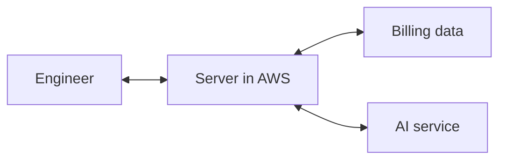

# Architecture (v1)

```mermaid
flowchart LR
    Engineer <--> Server["Server in AWS"]
    Server <--> Billing["Billing data"]
    Server <--> AI["AI service"]
```

All traffic goes through the server. The engineer never talks to billing data or the AI directly, so only one component needs permissions.
